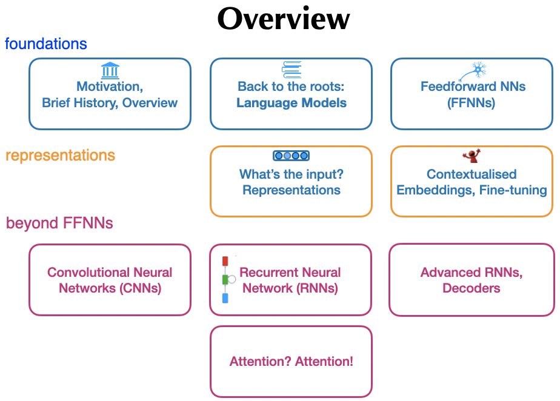

# teaching-dl4nlp material

## AthNLP 2019

Slides from a 3 hour lecture on "encoder-decoders" at AthNLP 2019 summer school.

Content:

## Malta 2019

Slides from a week-long course, which cover a subpart of the material covered above, complemented with exercises and code (Keras).

* Source: https://github.com/bplank/2019-ma-notebook

## Key references:

* [Jurafsky & Martin book](https://web.stanford.edu/~jurafsky/slp3/)
* [Goldberg's primer](https://arxiv.org/abs/1510.00726)
* [Kim 2014](https://arxiv.org/abs/1408.5882)
* [Peters et al., 2018](https://arxiv.org/abs/1802.05365)
* [Luong et al., 2015](https://arxiv.org/abs/1508.04025)
